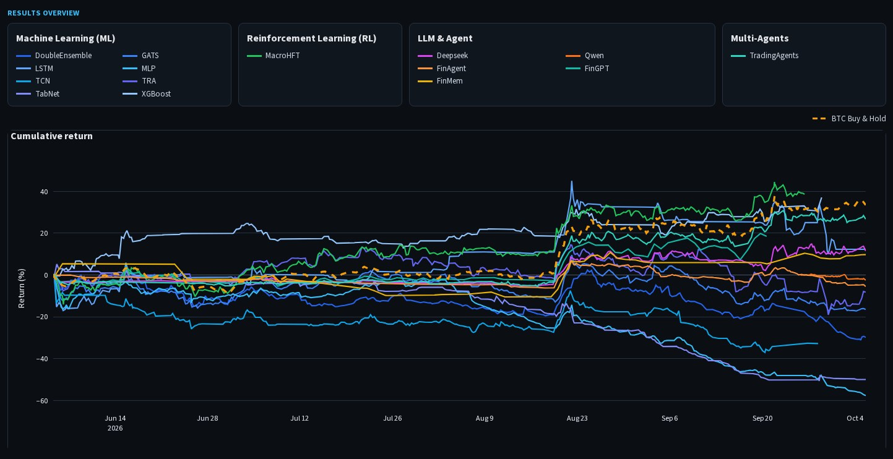

<div align="center">


<br>

*一个统一的 AI 交易方法评测基准，覆盖从历史回测到实时加密货币市场的完整流程。*


[**模拟交易**](https://quant-bench-showcase.streamlit.app/) ·
[**文档**](docs/index.md) ·
[**CLI 参考**](docs/reference/cli.md) ·
[**English**](README.md)


[](https://quant-bench-showcase.streamlit.app/)
[](https://github.com/Starlien95/Awesome-TradingAI/actions/workflows/ci.yml)
[](pyproject.toml)
[](LICENSE)

</div>

**Can AI Make Money in Crypto?（AI 能在加密货币市场赚钱吗？）** 是一个开源评测基准与代码库，用于评估加密货币市场中的 AI 交易方法，包括机器学习、强化学习、基于大语言模型（LLM）的方法以及交易智能体。项目为历史回测、加密货币交易所实时模拟交易和实盘交易提供统一接口，并持续发布回测与模拟交易结果。未来的评测还将加入真实资金交易结果。

## 📈 公开的交易所模拟交易结果

[打开公开结果面板](https://quant-bench-showcase.streamlit.app/)，可查看 16 个公开运行（覆盖 15 种不同方法）的归一化收益曲线、与 BTC 买入并持有策略的对比、回撤、交易信号、执行摘要、方法详情以及数据质量状态。

目前的公开结果使用 OKX 模拟交易环境，对应本项目的 `exchange-paper` 模式。该模式不同于本地 `local-paper` 执行和真实资金 `live` 交易。面板以只读方式运行，使用经过延迟和脱敏处理的结果快照；它无法访问交易所账户、读取交易凭据或提交订单。

公开展示窗口从 `2026-06-01 00:00 UTC` 开始。每种方法均以该时间点当日或之后的首个真实观测值为基准进行归一化。多智能体运行的首个真实观测值出现在 6 月 4 日，因此此前的时间段保持为空，不进行任何合成数据回填。



总览页面展示了全部公开方法、表现最佳的 5 种方法与 BTC 买入并持有策略的对比、按收益排序的排行榜，以及所有公开方法涉及的加密资产集合。在网站中打开 Strategy Detail（策略详情），可以查看各方法的确切资产代码、时间周期、执行模式、方法说明和数据窗口。

选取的历史研究证据与实时更新的交易所模拟交易表分开展示：

| 历史研究                                       |                                     报告结果 | 解读                                     |
| ---------------------------------------------- | -------------------------------------------: | ---------------------------------------- |
| GATs，4 小时 / 52 个特征，2020—2025 年         | 年化收益率 71.70%；IR 1.27；最大回撤 -33.97% | 具有代表性的机器学习工作簿结果           |
| FinGPT 预训练 LoRA，ETH                        |                +79.60%，买入并持有为 +29.37% | 已完成的历史做多/空仓研究                |
| FinAgent Qwen，BTC，2023 年阶段                |                +48.93%，买入并持有为 +57.67% | 收益为正，但低于其基准策略               |
| LLM 日频对话式 BTC 永续合约基线，2025 年上半年 |                    -74.20%；最大回撤 -91.07% | 保留已完成但失败的基线结果，以确保透明度 |

完整的精选表格、FinMem 结果、TradingAgents 缺失的证据以及解读限制，请参阅[历史回测结果](docs/HISTORICAL_BACKTEST_RESULTS.md)。

当前公开评测共覆盖 10 种加密货币：ADA、BTC、DOGE、ETH、HBAR、LINK、LTC、OKB、TRX 和 XRP。不同方法的资产范围有所不同：

| 公开方法                                                     | 当前公开评测中的资产                                |
| ------------------------------------------------------------ | --------------------------------------------------- |
| Traditional ML、FinGPT Sentiment SFT、Benchmark DeepSeek、Benchmark Qwen、FinAgent DeepSeek、TradingAgents | ADA、BTC、DOGE、ETH、HBAR、LINK、LTC、OKB、TRX、XRP |
| MacroHFT v1                                                  | ETH                                                 |
| FinMem                                                       | BTC                                                 |

## 🔥 最新动态

- **[2026 年 8 月 8 日]** OKX 公开模拟交易面板上线。
- **[2026 年 8 月 6 日]** 完整评测基准代码库发布。
- **[即将推出]** 真实资金实盘交易评测。

## 🎯 为什么需要这个评测基准？

大多数 AI 交易方法仅通过历史回测进行评估。然而，出色的回测表现并不一定能转化为在未知且持续变化的市场中的真实利润。我们分三个阶段评估交易方法：历史回测 → 实时模拟交易 → 实盘交易。我们的目标是回答一个简单的问题：

*AI 真的能在加密货币市场赚钱吗？*


## 🧩 支持的方法与功能

本仓库提供统一框架，用于集成、运行和评估采用不同技术范式的 AI 交易方法，覆盖从传统机器学习到基于 LLM 的交易智能体。

### 方法集成

| 类别                | 我们提供的功能                                               |
| ------------------- | ------------------------------------------------------------ |
| **传统机器学习**    | 面向经典基线和传统机器学习交易工作流的接口，包括训练、调优、回测和已保存模型的执行 |
| **强化学习**        | 面向强化学习交易方法的接口                                   |
| **基于 LLM 的交易** | 面向基于 LLM 的交易方法的接口                                |
| **交易智能体**      | 面向智能体交易方法的接口                                     |

### 核心能力

| 能力               | 我们提供的功能                                               |
| ------------------ | ------------------------------------------------------------ |
| **历史回测**       | 一致的回测环境，支持配置交易成本、投资组合参数以及可复现的实验配置 |
| **交易所模拟交易** | 通过交易所提供的模拟交易环境，在实时加密货币市场数据上运行受支持的方法，并持续跟踪其交易表现 |
| **统一方法接口**   | 用于配置、验证、运行和比较机器学习、强化学习、LLM 及智能体交易方法的通用接口 |
| **统一分析**       | 面向所有受支持方法的通用分析流程，涵盖收益、Alpha、回撤、交易信号、执行摘要和数据质量 |

默认的快速入门流程完全离线运行，不需要交易所凭据，也不会提交任何真实订单。

## 🚀 快速开始

### 安装

克隆仓库并安装所需依赖：

```bash
git clone https://github.com/Starlien95/Awesome-TradingAI.git
cd Awesome-TradingAI
python -m venv .venv
source .venv/bin/activate
python -m pip install --upgrade pip
python -m pip install -e .
```

有关支持的 Python 与平台版本、可选依赖、外部服务、GPU 适用范围以及离线安装要求，请参阅[环境与依赖要求](docs/ENVIRONMENT.md)。

只安装你需要的集成功能：

```bash
python -m pip install -e ".[dashboard]"
python -m pip install -e ".[qlib,lgbm]"
python -m pip install -e ".[data-qlib]"
python -m pip install -e ".[finmem,finmem-live]"
python -m pip install -e ".[news,fingpt-live,runtime]"
```

### 离线快速入门

无需网络连接或交易所凭据，即可在本地运行评测基准：

```bash
quant-bench doctor
quant-bench quickstart --offline --workspace ./qb-workspace
quant-bench report --workspace ./qb-workspace
```

离线快速入门使用项目内置的合成 BTC 和 ETH OHLCV 数据验证完整的评测流程。它会验证输入数据，构建可防止信息泄漏的特征与标签，训练轻量级 NumPy 基线模型，执行考虑交易成本的历史回测，并将生成的产物和校验和保存到 `qb-workspace/runs/` 下。

### 参数扫描

可以通过同一接口启动参数扫描：

```bash
quant-bench sweep crypto_smoke_v1 \
  --param model.parameters.ridge=0.0,0.000001,0.001 \
  --study-name ridge-example \
  --workspace ./qb-workspace

quant-bench compare --workspace ./qb-workspace
```

随后可以使用 `compare` 命令，在一致的评测协议下比较生成的各次运行。

### 本地面板

安装可选的面板依赖并启动本地分析面板：

```bash
python -m pip install -e ".[dashboard]"
quant-bench dashboard --workspace ./qb-workspace
```

该面板以交互方式展示所选工作区中存储的结果与产物。它以只读方式运行：不会训练模型、访问交易所账户、读取交易凭据、提交订单，也不会控制任何正在运行的交易进程。详情请参阅[查看结果](docs/how-to/results.md)和[面板设计](docs/design/LOCAL_ANALYTICS_DASHBOARD.md)。

### 方法与执行模式

使用以下命令查看可用方法及其支持的能力，并验证某种方法是否兼容指定的执行模式：

```bash
quant-bench methods list
quant-bench methods show canonical:crypto_smoke_v1
quant-bench methods check canonical:crypto_smoke_v1 \
  --mode backtest \
  --workspace ./qb-workspace
```

该框架支持四种执行模式：

| 模式             | 说明                                                         |
| ---------------- | ------------------------------------------------------------ |
| `backtest`       | 在不连接交易所账户的情况下，使用历史或合成市场数据评估方法   |
| `local-paper`    | 使用本地投资组合记账和模拟订单执行来运行方法，不向交易所提交订单 |
| `exchange-paper` | 使用实时市场数据和模拟资金，在交易所提供的模拟交易环境中运行方法；需要网络连接和交易所凭据 |
| `live`           | 使用真实资金在交易所实盘环境中运行方法；需要单独的交易权限，并明确提供 `LIVE_ORDERS` 确认信息 |

不同方法支持的执行能力各不相同。使用 `methods show` 可查看某种方法声明的执行模式、频率，以及网络、账户和订单能力。`methods check` 会验证已声明的本地前置条件，并输出经过脱敏的命令预览；它不会访问网络、查询账户、下单，也不能证明远程服务可用。通过 `ai_trade` 提供的外部方法集成将作为独立进程运行，并且需要一份经过单独审查的本地代码副本。

> **注意：** 本项目托管在 `Awesome-TradingAI` 仓库中。为保持向后兼容，Python 发行包和 CLI 仍沿用 `quant-bench` 和 `quant_bench` 名称。

## 🔌 公共接口

- [Python API](docs/reference/python-api.md)
- [CLI](docs/reference/cli.md)
- [统一方法接口](docs/how-to/unified-methods.md)
- [模型插件指南](docs/how-to/add-model.md)
- [统一交易接口](docs/how-to/unified-trading-interface.md)
- [数据契约](docs/DATA_CONTRACT.md)
- [运行时 CSV 模式](docs/runtime/CSV_SCHEMA.md)
- [产物与清单](docs/reference/artifacts.md)
- [仓库结构](docs/REPOSITORY_LAYOUT.md)
- [环境要求](docs/ENVIRONMENT.md)

仓库名称为 `Awesome TradingAI`。为保持 API 兼容，稳定版发行包、导入路径、CLI 和插件命名空间仍为 `quant-bench` 与 `quant_bench`。

## 🗂️ 仓库结构

```text
src/quant_bench/    可安装的库、CLI、方法、运行时和面板
tests/              契约测试、单元测试和集成测试
tools/              发布检查、工作流维护和兼容性工具
docs/               教程、指南、概念说明、参考资料和设计记录
release/            经检查的软件物料清单（SBOM）与依赖许可证元数据
.github/workflows/  测试、打包、文档和边界检查
```

运行时数据应存放在用户选定的工作区中。模型权重、交易所凭据、账户快照、订单、私有新闻、Qlib 数据存储以及完整的生产日志均不包含在本仓库内。

## 🛡️ 安全性与范围

- 回测、分析和面板命令不会向交易所提交订单。
- 凭据通过环境变量或未被版本控制跟踪的本地提供程序传入。
- 账户读取与订单写入使用独立的权限。
- 模拟订单与实盘订单需要不同且完全匹配的确认令牌。
- 本项目不提供账户清算和生产账本修复脚本。
- 公开评测基准的比较要求使用匹配的协议与数据集哈希值。

启用网络、账户或订单能力之前，请阅读[安全边界](docs/concepts/security-boundaries.md)。

## 🛠️ 开发与质量检查

安装开发依赖，并运行与 CI 相同的代码检查、静态类型检查、测试、文档构建和发布边界检查：

```bash
python -m pip install -e ".[dev,docs,dashboard]"
ruff check .
mypy --strict src/quant_bench
pytest -q
mkdocs build --strict
python tools/check_release.py
```

这些命令仅用于本地开发和验证。它们不会发布软件包、部署公开的 Streamlit 网站，也不会启动任何本地模拟交易、交易所模拟交易或实盘交易进程。

有关贡献指南、安全策略和第三方来源，请参阅[贡献指南](CONTRIBUTING.md)、[安全策略](SECURITY.md)和[来源登记表](docs/legal/PROVENANCE.md)。

本项目采用 MIT 许可证。随项目提供的第三方组件仍受其各自的声明和许可条款约束。


## 📖 引用

引用信息将在论文发表后补充。
