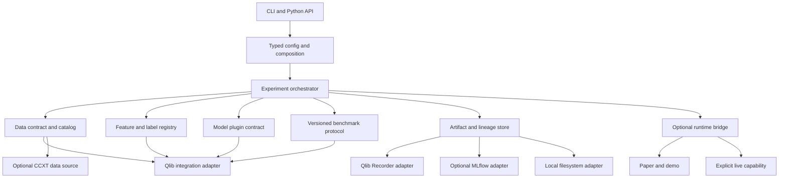
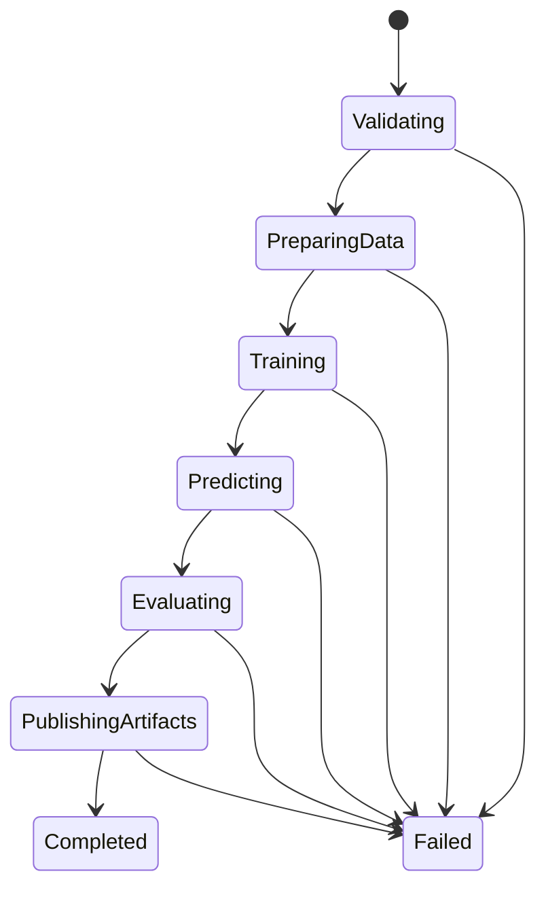
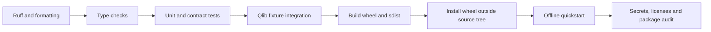

# `qlib_model_trade` 开源库化重构设计

## 文档状态

| 项目 | 内容 |
| --- | --- |
| 状态 | Implemented: package and licensing gates; remaining phases tracked |
| 目标分支 | `opensource` |
| 审计提交 | `1dd8045ffbaf4a1dd089ac1dd38e3b9b159f2a40` |
| 编写日期 | 2026-07-18 |
| 适用范围 | `qlib_model_trade` 的研究、训练、回测、调参、结果管理、Qlib 集成及其开源边界 |
| 不直接覆盖 | 私有运行日志、真实账户操作、生产凭据、未脱敏交易数据、第三方模型权重发布 |

## 1. 结论摘要

`qlib_model_trade` 当前具备数据准备、Qlib workflow、模型训练、回测、调参、策略部署、交易运行和结果展示能力。现有能力以脚本和目录约定组织，公共安装接口、稳定 Python API、配置契约、数据契约、实验协议、插件规范、发布流程和贡献者工作流尚未形成统一边界。

本设计建议将公开发行物命名为 `quant-bench`，Python 导入名统一为 `quant_bench`。`qlib_model_trade` 在迁移期保留为兼容入口，其研究能力逐步迁移到仓库根目录的 `src/quant_bench/`。Qlib 作为首个完整 backend 集成到 `quant_bench.integrations.qlib`，公共数据、模型、评估和 artifact 契约保持与 Qlib 解耦，以便后续接入强化学习、FinGPT news 和其他方法族。

重构后的首要用户路径应满足以下条件：

1. 用户可以从 wheel 安装项目，不依赖仓库当前工作目录或手工修改 `PYTHONPATH`。
2. `quant-bench quickstart --offline` 使用仓库内小型脱敏 fixture，完成数据校验、训练、推理、回测和报告生成。
3. 每次实验使用类型化配置，生成完整 `resolved_config.yaml`、`run_manifest.json`、指标、预测、回测结果和校验和。
4. 模型、feature set、data source、evaluator 通过稳定协议和 entry point 扩展，新增模型无需修改主训练脚本。
5. 默认安装不包含 OKX、FinGPT 13B、Streamlit、全部深度学习框架和真实交易能力。
6. 研究、paper trading、OKX demo、live trading 在命令、依赖、文档和安全门禁上明确分层。
7. benchmark 结果由版本化 protocol 约束，统一数据版本、时间切分、费用、随机种子、指标定义和结果披露规则。

## 2. 审计范围与事实基线

### 2.1 已审计材料

本设计以 `opensource` 分支当前源码为基线，已读取并检查以下直接相关材料：

- `README.md`
- `CLEANUP.md`
- `docs/ARCHITECTURE.md`
- `docs/TRADING_FLOW.md`
- `docs/CSV_SCHEMA.md`
- `docs/QUANT_TRADE_FRAMEWORK.md`
- `docs/NETWORK_ACCESS.md`
- `docs/LIVE_FINGPT_NEWS_DESIGN.md`
- `methods/traditional_ml/README.md`
- `methods/reinforcement_learning/README.md`
- `methods/reinforcement_learning/macrohft_v1/README.md`
- `methods/fingpt_news/README.md`
- `data_pipeline.py`
- `train_model.py`
- `backtest_model.py`
- `deploy_to_framework.py`
- `workflow_utils.py`
- `custom_handler_158.py`
- `custom_handler_360.py`
- `custom_strategy.py`
- `hyperparam_sweep.py`
- `auto_tune_trade_models.py`
- `core/`、`strategy_adapters/`、`methods/`、`registry/` 和 active configs 中的相关实现与配置

同时对 `qlib_model_trade` 下全部 75 个 Python 文件进行了结构化静态检查，对全部 216 个 YAML 文件进行了语法解析、内容哈希、关键字段和路径统计。

### 2.2 当前目录量化结果

| 项目 | 当前结果 |
| --- | ---: |
| tracked files | 324 |
| Python files | 75 |
| YAML files | 216 |
| Markdown files | 12 |
| workflow YAML files | 202 |
| YAML parse errors | 0 |
| unique YAML content hashes | 214 |
| `workflow/158` files | 98 |
| `workflow/360` files | 105 |

202 个 workflow YAML 将模型、频率、数据路径、时间切分、handler、label、策略和费用复制到独立文件。该结构可以运行固定实验，扩展新数据集、新频率、新 protocol 或新模型时会持续增加重复配置和组合检查成本。

### 2.3 已核验的结构问题

1. 仓库缺少 `pyproject.toml`、可安装 package、console entry point 和稳定 import namespace。`core/`、`strategy_adapters/` 等目录依赖项目根目录导入，部分流程通过 `sys.path` 修改解决本地模块加载。
2. `requirements.txt` 同时安装 Qlib、数据下载、传统模型、PyTorch、MLflow、Streamlit、OKX、FinGPT 和 Hugging Face 依赖。初次使用者必须承担所有能力的安装成本。
3. `train_model.py` 同时负责配置解析、Qlib 初始化、随机种子、训练、评估、回测、artifact 保存和部署，还在 import 阶段全局修改 `torch.load` 行为。
4. `backtest_model.py` 重复实现配置、随机种子、Qlib 初始化、频率和 benchmark 处理，并再次全局修改 `torch.load`。
5. `deploy_to_framework.py` 通过字符串和行级操作更新 YAML，并按扩展名复制模型文件。部署输入输出未形成 schema 和事务边界。
6. `data_pipeline.py` 同时承担 CCXT 网络下载、raw CSV、数据切分和 Qlib bin 导出。下载逻辑对异常持续重试，缺少重试上限、数据 manifest 和 source license 字段。
7. 当前 `vwap` 计算为 `(open + high + low) / 3`。该字段语义是 typical price proxy，不满足成交量加权定义。
8. `CustomHandler158` 实际生成 52 个特征，`CustomHandler360` 实际生成 6 个特征。名称无法准确表达 feature schema。
9. 模型 artifact 以 pickle 和完整 Python object 为主。该格式依赖类路径和 Python 环境，不能作为面向不受信环境的公共交换格式。
10. 27 个 workflow 仍引用 `~/.qlib/qlib_data/cn_data` 和 `csi300`。35 个 workflow 使用 Qlib 内置 `TopkDropoutStrategy`，与项目文档声明的统一 `ThresholdTopkDropoutStrategy` 语义不一致。
11. 13 个 workflow 依赖本地模块路径，6 个配置包含 `sys.rel_path: "."`。FinGPT active config 中存在开发机绝对模型路径。
12. workflow 中存在至少 29 种 label 表达式。已发现 `Ref($close, -4)/ $close - 1) * 20` 含有未配对括号，当前没有统一的 label 编译和 schema 校验门禁。
13. active traditional README 包含开发机虚拟环境和模型目录绝对路径。开源用户无法通过这些路径复现流程。
14. registry 已登记部分传统模型、FinGPT 和 MacroHFT，active config 中存在的 TabNet 与 TCN 未完整进入统一注册面。
15. 当前 GitHub Actions 只覆盖独立的 FinMem public check，没有覆盖 package build、wheel 安装、配置渲染、测试矩阵、license、secret 和 no-network quickstart。

### 2.4 开源发布阻断项

以下事项在正式公共发布前必须关闭：

- 第三方导入代码、adapter、数据 dumper、MacroHFT、FinGPT 相关代码和权重的来源、版本、许可证与修改记录。
- 所有开发机绝对路径、账户信息、模型目录、真实日志和未脱敏数据引用。
- pickle 加载的信任边界。公共 CLI 不应自动加载来源不明的 pickle。
- live trading 与 research 命令的能力隔离、凭据来源和二次确认。
- benchmark 数据源允许的再分发范围。无法再分发时提供下载器、校验和、fixture 和 data card。

## 3. 外部项目参考与采用原则

本设计只采用官方仓库、官方文档或 Python 官方打包规范作为架构依据。

| 参考项目 | 已核验实践 | 本项目采用内容 |
| --- | --- | --- |
| [Qlib](https://github.com/microsoft/qlib) | `qrun` 配置工作流、Recorder、benchmark examples、online serving | 保留 Qlib workflow 兼容层，显式使用 `R.start` 和 Recorder，配置由统一 schema 生成 |
| [Qlib benchmark examples](https://github.com/microsoft/qlib/tree/main/examples/benchmarks) | 每个模型和数据集有可复现实验配置，随机模型建议多次运行并报告统计量 | 定义 smoke、standard、publication 三档 protocol，publication 默认 20 个 seed 并报告 mean/std |
| [Freqtrade](https://github.com/freqtrade/freqtrade) | 单一 CLI、strategy interface、用户数据目录、backtest 与 live 复用、可选依赖 | 提供 `quant-bench` CLI、workspace、插件接口和分层 extras |
| [Freqtrade Hyperopt](https://www.freqtrade.io/en/stable/hyperopt/) | 可恢复调参、随机种子、搜索空间与策略解耦 | `sweep` 采用结构化 search space、持久化 study 和可恢复执行 |
| [FinRL](https://github.com/AI4Finance-Foundation/FinRL) | data、environment、agent 的分层结构 | 数据、特征、模型、评估职责分离，RL 通过公共 contract 接入 |
| [NautilusTrader architecture](https://nautilustrader.io/docs/nightly/concepts/architecture/) | ports and adapters、研究与运行语义复用 | 外部数据、Qlib、artifact store、tracker 通过 adapter 接入 |
| [NautilusTrader adapters](https://nautilustrader.io/docs/latest/developer_guide/adapters/) | typed config、factory、凭据环境变量、adapter 测试 | adapter 声明 capability、config schema、factory 和 contract test |
| [Hydra defaults](https://hydra.cc/docs/tutorials/basic/your_first_app/defaults/) | config group 和 defaults composition | CLI 边界使用配置组合，消除模型与频率的复制矩阵 |
| [Hydra CLI overrides](https://hydra.cc/docs/advanced/hydra-command-line-flags/) | 可追踪的命令行 override | 将 override 写入 resolved config 和 run manifest |
| [Python Packaging User Guide](https://packaging.python.org/en/latest/guides/writing-pyproject-toml/) | `pyproject.toml`、build backend、project metadata | 使用标准 wheel 和 sdist 发布流程 |
| [Python `src` layout guidance](https://packaging.python.org/en/latest/discussions/src-layout-vs-flat-layout/) | 避免从仓库根目录意外导入未安装源码 | 采用 `src/quant_bench` 并从已安装 wheel 运行 CI |
| [PyPA entry points](https://packaging.python.org/en/latest/specifications/entry-points/) | console script 和插件发现 | `quant-bench` 命令及模型、数据源、feature、evaluator 插件组 |
| [pytest good practices](https://docs.pytest.org/en/stable/explanation/goodpractices.html) | `src` layout、installed-package tests、importlib mode | 测试 wheel 安装结果，不依赖源码目录 import |
| [Pydantic models](https://docs.pydantic.dev/latest/concepts/models/) | 类型化输入、验证和序列化 | 所有公共 config 和 manifest 使用版本化 Pydantic schema |
| [Pydantic Settings](https://docs.pydantic.dev/latest/concepts/pydantic_settings/) | 环境变量配置 | 凭据只从环境或本地未提交配置读取 |
| [MLflow Tracking](https://mlflow.org/docs/latest/ml/tracking/) | params、metrics、artifacts、run lineage | 提供可选 `MLflowTracker`，公共 run contract 不绑定 MLflow |
| [MLflow Model Registry](https://mlflow.org/docs/latest/ml/model-registry/workflow) | 模型版本、alias、tag、lineage | 生产部署阶段通过可选 artifact registry 管理版本 |
| [Optuna RDB](https://optuna.readthedocs.io/en/stable/tutorial/20_recipes/001_rdb.html) | study 持久化和恢复 | sweep 使用 SQLite 或 RDB storage，支持中断恢复 |
| [DVC experiment versioning](https://dvc.org/blog/ml-experiment-versioning/) | 数据和实验版本关联 | 大型公共数据与模型采用可选 DVC remote，Git 中只留 metadata |

采用外部项目的接口思想时，禁止复制未知许可证代码。实现应基于本项目 contract 独立编写，并在 `THIRD_PARTY_NOTICES.md` 中记录依赖、引用、许可证和用途。

## 4. 目标、非目标与设计原则

### 4.1 目标

1. 将项目从脚本集合收敛为可安装、可导入、可扩展、可验证的 benchmark library。
2. 支持从数据获取到报告生成的完整研究流程，并允许每个阶段被独立调用。
3. 统一 traditional ML、RL、FinGPT news 和后续方法族的运行记录与评估协议。
4. 保留 Qlib 的 Dataset、Model、Recorder 和 backtest 能力，同时避免公共 contract 泄漏 Qlib 私有对象结构。
5. 让外部贡献者能够通过模板和 contract tests 增加模型、feature、数据源或 evaluator。
6. 每个公开结果可以追溯到代码、配置、数据、依赖、seed、protocol 和 artifact 校验和。
7. 默认流程离线、安全、轻量，不访问 OKX，不读取凭据，不执行订单。

### 4.2 非目标

1. 第一阶段不重写 Qlib 内部训练和回测引擎。
2. 第一阶段不提供真实账户托管服务。
3. 第一阶段不在公共仓库发布大型模型权重、完整 Qlib bin 数据、生产日志和未脱敏订单流水。
4. 第一阶段不保证旧版 202 个 workflow YAML 继续作为主要维护接口。迁移期提供转换和兼容执行。
5. 第一阶段不把 Streamlit Community Cloud 作为训练或推理环境。

### 4.3 设计原则

- **Contract first**：数据、模型、评估、artifact 和插件先定义稳定 schema。
- **Offline first**：quickstart、单元测试和基础 CI 不依赖公网。
- **Safe by default**：研究命令没有下单能力，live capability 必须显式安装和确认。
- **One resolved truth**：每次运行只有一个完成验证的 resolved config。
- **Reproducible by record**：代码、数据、配置、环境、seed 和输出全部进入 manifest。
- **Composition over copy**：通过 config group 组合模型、频率、feature 和 protocol。
- **Backend isolation**：Qlib、MLflow、DVC、CCXT、OKX 均通过 adapter 接入。
- **Small public surface**：稳定 API 只暴露 contract、runner、registry 和结果对象。
- **Version every semantic boundary**：dataset、feature、label、protocol、manifest 和 plugin contract 均带版本。

## 5. 目标架构

### 5.1 逻辑分层



### 5.2 目标仓库结构

公开 package 应位于仓库根目录。`qlib_model_trade` 在迁移期保存兼容脚本、迁移工具和历史说明。

```text
quant_bench/
├── pyproject.toml
├── README.md
├── LICENSE
├── SECURITY.md
├── CONTRIBUTING.md
├── CODE_OF_CONDUCT.md
├── CHANGELOG.md
├── THIRD_PARTY_NOTICES.md
├── src/
│   └── quant_bench/
│       ├── __init__.py
│       ├── cli/
│       │   ├── app.py
│       │   └── commands/
│       ├── contracts/
│       │   ├── data.py
│       │   ├── model.py
│       │   ├── feature.py
│       │   ├── evaluation.py
│       │   ├── artifact.py
│       │   └── plugin.py
│       ├── config/
│       │   ├── models.py
│       │   ├── loader.py
│       │   └── validation.py
│       ├── data/
│       │   ├── catalog.py
│       │   ├── validation.py
│       │   ├── transforms.py
│       │   └── sources/
│       ├── features/
│       ├── labels/
│       ├── models/
│       ├── strategies/
│       ├── experiments/
│       │   ├── runner.py
│       │   ├── context.py
│       │   └── lifecycle.py
│       ├── evaluation/
│       ├── tuning/
│       ├── artifacts/
│       ├── registry/
│       ├── integrations/
│       │   ├── qlib/
│       │   ├── mlflow/
│       │   ├── dvc/
│       │   └── ccxt/
│       └── runtime/
│           └── bridge.py
├── configs/
│   ├── data/
│   ├── universe/
│   ├── frequency/
│   ├── feature/
│   ├── label/
│   ├── model/
│   ├── protocol/
│   ├── tracker/
│   └── experiment/
├── benchmarks/
│   ├── crypto_smoke_v1.yaml
│   ├── crypto_standard_v1.yaml
│   └── crypto_publication_v1.yaml
├── examples/
│   ├── quickstart/
│   ├── custom_model/
│   └── custom_feature/
├── tests/
│   ├── unit/
│   ├── contract/
│   ├── integration/
│   ├── regression/
│   └── fixtures/
├── docs/
│   ├── tutorials/
│   ├── how-to/
│   ├── concepts/
│   ├── reference/
│   ├── benchmark-cards/
│   └── model-cards/
└── qlib_model_trade/
    ├── README.md
    ├── MIGRATION.md
    ├── legacy_configs/
    └── compatibility_shims/
```

### 5.3 package 边界

| package | 职责 | 禁止承担的职责 |
| --- | --- | --- |
| `contracts` | 稳定类型、协议、schema version | Qlib 初始化、文件 I/O、网络访问 |
| `config` | load、compose、validate、freeze | 训练模型、下载数据 |
| `data` | 标准 schema、catalog、校验、转换 | 模型训练、下单 |
| `features` | feature set 定义和 metadata | 账户状态、artifact 发布 |
| `labels` | label 定义、horizon 和泄漏校验 | 回测撮合 |
| `models` | 内置模型 plugin 与 capability | 全局修改第三方库行为 |
| `experiments` | 生命周期编排、状态和失败处理 | backend 特有实现细节 |
| `evaluation` | protocol、指标、比较和报告 | 修改训练数据 |
| `artifacts` | manifest、校验和、存储接口 | 任意反序列化不受信 pickle |
| `integrations.qlib` | Qlib adapter、Dataset 转换、Recorder | 成为所有公共接口的类型来源 |
| `runtime` | 研究输出到运行框架的显式桥接 | 默认安装即获得 live 下单能力 |

## 6. 公共 API 与插件协议

### 6.1 稳定公共 API

首个稳定版本只承诺以下入口：

```python
from quant_bench import Experiment, load_config
from quant_bench.contracts import (
    DatasetManifest,
    ExperimentResult,
    ModelPlugin,
    PredictionFrame,
    RunManifest,
)

config = load_config("crypto/lightgbm_1h", overrides=["protocol=smoke"])
result: ExperimentResult = Experiment(config).run()
```

内部 Qlib handler、Qlib Recorder object、MLflow client、CCXT exchange object 和 OKX client 不属于稳定公共 API。

### 6.2 ModelPlugin

模型扩展接口应表达 capability，不依赖文件名和 `if model_type` 分支。

```python
from typing import Protocol

class ModelPlugin(Protocol):
    plugin_id: str
    contract_version: str

    def capabilities(self) -> "ModelCapabilities": ...
    def fit(self, dataset: "DatasetView", context: "RunContext") -> "FittedModel": ...
    def predict(self, model: "FittedModel", dataset: "DatasetView") -> "PredictionFrame": ...
    def save(self, model: "FittedModel", target: "ArtifactWriter") -> "ModelArtifact": ...
    def load(self, source: "ArtifactReader") -> "FittedModel": ...
```

`ModelCapabilities` 至少声明：

- 支持的 task type，例如 regression、classification、ranking、RL。
- 支持的 feature shape，例如 tabular、sequence、graph、multi-task。
- CPU/GPU 需求。
- deterministic 支持范围。
- 可接受的 native artifact format。
- 可用的 optional extra。
- 是否支持 incremental fit、warm start 和 online inference。

### 6.3 插件发现

使用 PyPA entry point，建议定义以下 group：

```toml
[project.entry-points."quant_bench.models"]
lightgbm = "quant_bench.models.lightgbm:LightGBMPlugin"

[project.entry-points."quant_bench.features"]
crypto_alpha52_v1 = "quant_bench.features.crypto_alpha52:CryptoAlpha52V1"

[project.entry-points."quant_bench.data_sources"]
ccxt_ohlcv = "quant_bench.integrations.ccxt:CCXTOHLCVSource"

[project.entry-points."quant_bench.evaluators"]
qlib_portfolio = "quant_bench.integrations.qlib.evaluation:QlibPortfolioEvaluator"
```

每个第三方插件必须通过公共 contract test suite。插件加载失败时输出 plugin id、distribution、version、entry point 和原始异常，禁止静默回退到其他实现。

### 6.4 内置模型范围

第一批内置模型按依赖和维护成本分层：

| 层级 | 模型 | 安装 extra | CI 要求 |
| --- | --- | --- | --- |
| baseline | Linear、naive momentum、LightGBM | `core`、`lgbm` | 每次提交 |
| tree | XGBoost、CatBoost、DoubleEnsemble | `xgboost`、`catboost`、`qlib` | 每次 PR 或 nightly |
| torch | MLP、LSTM、TCN、TRA、GATs、TabNet | `torch` | CPU smoke 与 nightly 完整测试 |
| RL | MacroHFT adapter | `rl` | 固定 fixture contract test |
| news | FinGPT sentiment adapter | `news` | mock inference contract test，真实模型手工验证 |

模型进入 registry 的条件包括 config schema、最小 fixture、训练与加载测试、artifact format、model card、依赖 extra、license/provenance 和 benchmark protocol 支持情况。

## 7. CLI 与用户工作流

### 7.1 单一入口

`pyproject.toml` 提供：

```toml
[project.scripts]
quant-bench = "quant_bench.cli.app:main"
```

建议命令面如下：

```text
quant-bench quickstart
quant-bench doctor
quant-bench plugins list
quant-bench config list
quant-bench config render
quant-bench config validate
quant-bench data pull
quant-bench data validate
quant-bench data build
quant-bench run
quant-bench backtest
quant-bench sweep
quant-bench compare
quant-bench artifacts inspect
quant-bench artifacts verify
quant-bench runtime paper
quant-bench runtime demo
quant-bench runtime live
```

### 7.2 首次使用路径

```bash
python -m venv .venv
source .venv/bin/activate
python -m pip install "quant-bench[qlib,lgbm]"
quant-bench doctor
quant-bench quickstart --offline --workspace ./qb-workspace
quant-bench compare --workspace ./qb-workspace
```

`quickstart --offline` 必须做到：

1. 只读取随 wheel 或 examples 发布的小型脱敏 OHLCV fixture。
2. 校验 UTC、symbol、frequency、缺失值、重复 timestamp 和价格约束。
3. 构建 `CryptoOHLCV6V1` 或 `CryptoAlpha52V1`。
4. 训练轻量 baseline。
5. 生成预测、回测结果、指标、manifest 和 HTML 或 Markdown summary。
6. 不读取凭据，不访问公网，不导入 OKX 或 FinGPT 依赖。

### 7.3 workspace

所有生成文件写入显式 workspace，默认使用用户目录下的平台数据目录，也允许通过 `--workspace` 覆盖。

```text
qb-workspace/
├── datasets/
├── caches/
├── studies/
├── runs/
│   └── <run_id>/
├── reports/
└── local-config/
```

仓库源码目录不得成为默认运行输出目录。CLI 在 source tree 和已安装 wheel 下应产生一致结果。

### 7.4 doctor

`doctor` 输出机器可读 JSON 和终端摘要，至少检查：

- Python 和 `quant-bench` 版本。
- 已安装 extras 与 plugin 列表。
- Qlib import 和版本。
- workspace 可写性和剩余空间。
- 配置中的绝对路径和缺失文件。
- CUDA 仅在选用 GPU 模型时检查。
- 凭据只报告是否存在，禁止输出值。
- network capability 只在显式 `--network` 时检查。

## 8. 类型化配置与组合系统

### 8.1 两层职责

1. Hydra 或 OmegaConf 负责 CLI 边界的 config group 组合和 override。
2. Pydantic model 负责最终 resolved config 的类型、枚举、跨字段约束和序列化。

组合结果必须立即转换成 Pydantic 对象。训练和评估代码只接收验证后的对象，禁止在运行中读取散落 YAML 字典。

### 8.2 config group

```yaml
defaults:
  - data: ccxt_ohlcv_v1
  - universe: crypto_top10_v1
  - frequency: 1h
  - feature: crypto_alpha52_v1
  - label: forward_return_v1
  - model: lightgbm_v1
  - protocol: crypto_standard_v1
  - tracker: qlib_local_v1
  - _self_

experiment:
  name: lightgbm_crypto_1h
  seed: 42
  workspace: ${oc.env:QUANT_BENCH_HOME,./qb-workspace}
```

这样可以将当前 202 个 workflow 文件收敛为少量独立 group 和经过测试的 experiment recipe。支持的组合由兼容性矩阵声明，禁止对所有 group 做无约束笛卡尔积。

### 8.3 关键 schema

```python
class ExperimentConfig(BaseModel):
    schema_version: Literal["1"]
    experiment: ExperimentSpec
    data: DataSpec
    universe: UniverseSpec
    frequency: FrequencySpec
    features: FeatureSpec
    label: LabelSpec
    model: ModelSpec
    protocol: BenchmarkProtocolSpec
    tracker: TrackerSpec
    runtime: RuntimeSpec | None = None
```

跨字段校验至少包括：

- feature frequency 与 dataset frequency 一致。
- label horizon 能映射到 frequency。
- time split 给 label horizon 留出 purge 或 embargo 空间。
- model capability 接受 feature shape 和 task type。
- benchmark instrument 属于可用 universe 或被显式标记为外部 benchmark。
- execution cost 单位和值域明确。
- live runtime 禁止引用 research-only artifact。
- publication protocol 禁止使用未冻结数据版本。

### 8.4 resolved config

每次运行保存：

- 原始 recipe id。
- 所有 CLI overrides。
- 完整 `resolved_config.yaml`。
- canonical JSON 的 SHA-256 config hash。
- schema version。
- secret 字段的已脱敏表示。

manifest 中记录 hash，报告页面展示 recipe 和 overrides。运行结束后禁止原地修改 resolved config。

### 8.5 旧 workflow 转换

提供只读转换命令：

```bash
quant-bench config migrate-qlib \
  qlib_model_trade/workflow/158/workflow_config_lightgbm_1h.yaml \
  --output migrated/lightgbm_1h.yaml
```

转换器应完成：

1. 解析 Qlib init、dataset、handler、model、record、portfolio analysis。
2. 将可识别字段映射到公共 schema。
3. 对自定义 module path、未知 class、表达式和绝对路径生成明确诊断。
4. 保留无法转换的 Qlib fragment 到 `legacy.qlib_fragment`，并标记 recipe 不具备 publication 资格。
5. 生成迁移报告，不改写原文件。

## 9. 数据层设计

### 9.1 canonical market data schema

公开数据表至少包含：

| 字段 | 类型 | 约束 |
| --- | --- | --- |
| `timestamp` | UTC datetime | 同一 symbol 严格递增 |
| `symbol` | string | 使用 catalog 中 canonical symbol |
| `open` | float64 | `> 0` |
| `high` | float64 | `>= max(open, close, low)` |
| `low` | float64 | `<= min(open, close, high)` |
| `close` | float64 | `> 0` |
| `volume` | float64 | `>= 0`，必须声明 base 或 quote unit |
| `source` | string | data source id |
| `frequency` | string | canonical frequency |

可选字段 `vwap` 必须携带真实计算方法和所需成交量语义。当前 `(open + high + low) / 3` 应迁移为 `typical_price`，兼容层可以读取旧 `vwap` 并在 manifest 中记录 `legacy_semantics: typical_price_proxy`。

### 9.2 DatasetManifest

```json
{
  "schema_version": "1",
  "dataset_id": "crypto_ohlcv_binance_spot_1h_v1",
  "content_sha256": "...",
  "source": {
    "plugin_id": "ccxt_ohlcv",
    "exchange": "binance",
    "market_type": "spot",
    "source_version": "..."
  },
  "license": {
    "redistribution": "metadata_only",
    "terms_url": "..."
  },
  "time": {
    "timezone": "UTC",
    "frequency": "1h",
    "start": "2020-02-01T00:00:00Z",
    "end": "2025-12-31T23:00:00Z"
  },
  "universe_id": "crypto_top10_v1",
  "symbols": ["BTC/USDT", "ETH/USDT"],
  "rows": 0,
  "validation_report": "validation.json"
}
```

`rows` 示例在真实写入时必须是准确计数。数据下载和转换阶段分别生成 source manifest 和 derived manifest，derived manifest 记录 parent dataset hash 和 transform version。

### 9.3 数据流水线拆分

当前 `data_pipeline.py` 拆为四类职责：

| 当前职责 | 目标模块 |
| --- | --- |
| CCXT 下载 | `integrations.ccxt.source.CCXTOHLCVSource` |
| raw normalization | `data.transforms.normalize_ohlcv` |
| schema 校验 | `data.validation.MarketDataValidator` |
| Qlib bin 导出 | `integrations.qlib.dataset.QlibDatasetBuilder` |

下载器必须具备 timeout、指数退避、最大重试次数、rate-limit 事件、断点续传、请求窗口记录和失败状态。数据源返回空区间时写明确结果，禁止无限循环。

### 9.4 fixture 与公开数据

- Git 中只保留小型、脱敏、许可清晰的 fixture。
- fixture 覆盖多 symbol、缺失 bar、重复 bar、零 volume 和时间边界。
- 大型公开数据通过下载器或 DVC 获取，并校验 manifest hash。
- 数据不可再分发时只发布脚本、data card、schema 和 checksum。
- fixture 明确标记 `synthetic` 或数据许可，不得让用户将其视为正式 benchmark 结果。

## 10. Feature 与 Label 设计

### 10.1 feature set 命名

将 feature 数量、语义和版本写入名称及 metadata：

| 旧名称 | 新名称 | 迁移说明 |
| --- | --- | --- |
| `CustomHandler158` | `CryptoAlpha52V1` | 实际 52 个特征，旧 class 保留 deprecated alias |
| `CustomHandler360` | `CryptoOHLCV6V1` | 实际 6 个基础特征，旧 class 保留 deprecated alias |
| Qlib `Alpha158` | `QlibAlpha158V1` | 标记为 Qlib built-in feature set |
| Qlib `Alpha360` | `QlibAlpha360V1` | 标记为 Qlib built-in feature set |

每个 feature set 输出：

- `feature_set_id` 和 semantic version。
- 列名、dtype、顺序、公式摘要。
- 所需原始字段和 lookback。
- 是否允许使用当前 bar close。
- NaN、inf、winsorize、normalize 规则。
- feature schema hash。

### 10.2 LabelSpec

Label 不再以任意字符串散落在 workflow 中。公共 schema 至少包含：

```yaml
label_id: forward_return_4bars_v1
task_type: regression
horizon_bars: 4
entry_price: close_t1
exit_price: close_t4
formula: "Ref($close, -4) / Ref($close, -1) - 1"
scale: 20.0
clip: null
```

表达式必须经过：

1. 语法解析和括号检查。
2. 字段白名单。
3. horizon 推导。
4. train/valid/test 边界泄漏检查。
5. 小型确定性序列的 golden test。

对现有至少 29 种表达式建立 inventory，合并等价表达式，对不等价项生成独立 `label_id`。发现的未配对括号配置必须在迁移报告中标为 error。

### 10.3 时间泄漏控制

`BenchmarkProtocol` 同时拥有 split、label horizon、purge、embargo 和 fitting window。训练数据的最后可用 label timestamp 必须早于 validation 的首个决策 timestamp。rolling 和 expanding window 作为显式 protocol variant，禁止由脚本临时计算。

## 11. Qlib 集成层

### 11.1 职责

`integrations.qlib` 负责：

- 从 canonical config 生成 Qlib init config。
- 从 `DatasetManifest` 构建 Qlib provider 或 dataset。
- 将 `FeatureSet` 和 `LabelSpec` 转换为 handler。
- 将 `ModelPlugin` 与 Qlib model adapter 对接。
- 执行 Qlib Recorder、SignalRecord、SigAnaRecord 和 PortAnaRecord。
- 将 Qlib 输出转换为公共 `PredictionFrame`、`MetricsFrame` 和 `BacktestResult`。

### 11.2 初始化边界

Qlib 初始化由 `QlibSession` context manager 管理：

```python
with QlibSession(config.qlib) as session:
    result = session.run(experiment)
```

禁止在 import 阶段初始化 Qlib、修改日志全局状态或修改 `torch.load`。涉及旧 checkpoint 的 `weights_only=False` 只能在明确的 trusted-local migration command 中使用，并展示安全警告。

### 11.3 Recorder

所有 Qlib 实验显式使用：

```python
with R.start(experiment_name=..., recorder_name=...):
    R.log_params(...)
    model.fit(dataset)
    R.save_objects(...)
```

公共 `Tracker` 接口提供 `NullTracker`、`LocalTracker`、`QlibRecorderTracker` 和可选 `MLflowTracker`。同一次运行只指定一个 primary tracker，其他 tracker 作为 mirror，避免当前本地 `mlruns` 与 Qlib Recorder 各自形成不一致事实源。

### 11.4 策略语义

`ThresholdTopkDropoutStrategy` 作为版本化策略：

- `strategy_id: threshold_topk_dropout_v1`
- 明确 threshold、top_k、max_dropout、risk_degree、rebalance_policy。
- 对候选过滤、旧持仓 dropout、等权目标和最大持仓数编写 property test。
- Qlib research backtest 与 runtime adapter 共享同一组输入输出 fixture。
- 旧 Qlib `TopkDropoutStrategy` recipe 必须显式标记 legacy semantic，禁止与 v1 结果直接合并排名。

## 12. 实验生命周期

### 12.1 状态机



每个状态写入原子状态文件和 audit event。失败 run 保留 resolved config、环境信息、失败阶段、异常类型和已生成 artifact，禁止将失败目录覆盖为下一次运行。

### 12.2 RunContext

`RunContext` 提供：

- `run_id`、workspace、临时目录。
- resolved config 和 hash。
- code version、package versions、Python、Qlib 版本。
- seed manager。
- tracker、artifact writer 和 structured logger。
- network policy 和 capability flags。

训练函数不再读取全局路径、环境当前目录或散落环境变量。

### 12.3 随机性

统一 `SeedManager` 设置 Python、NumPy、PyTorch 和模型库 seed，并记录：

- 请求 seed。
- 各 backend 实际 seed。
- deterministic flags。
- 无法提供 deterministic guarantee 的算子或模型声明。

结果报告区分 deterministic run 和 stochastic run。单次 stochastic 结果不能进入 publication ranking。

## 13. Benchmark 与评估协议

### 13.1 protocol 是版本化公开资产

一个 protocol 完整定义：

- dataset id 和 checksum。
- universe 及成分变更规则。
- frequency、calendar、timezone。
- train、valid、test split。
- label、purge、embargo。
- signal 到 position 的策略。
- benchmark。
- initial cash、fees、slippage、minimum cost。
- tradability、limit、missing bar 和 delisting 处理。
- 指标定义、annualization 和 NaN policy。
- seed set 和聚合方法。
- required artifact 与披露字段。

任何影响结果可比性的变更都创建新 protocol version。

### 13.2 三档执行

| protocol tier | 用途 | 数据规模 | seed | 输出 |
| --- | --- | --- | ---: | --- |
| `smoke` | 安装和贡献者验证 | 小型 fixture | 1 | schema、流程与 artifact 完整性 |
| `standard` | 日常模型比较 | 冻结公开数据 | 5 | 每个 seed、mean/std、成本后指标 |
| `publication` | 论文与公共榜单 | 冻结发布数据 | 20 | 完整 seed 分布、置信区间、失败 run、限制说明 |

Qlib benchmark 官方说明建议随机模型执行多次并报告 mean/std，示例表使用 20 次运行。本项目将 20 个 seed 固化为 publication v1 的默认规则。调整 seed 数量需要创建新 protocol version。

### 13.3 指标

最低指标集：

- signal：IC、Rank IC、ICIR、有效样本数、coverage。
- return：累计收益、年化收益、波动率、Sharpe、Sortino。
- risk：max drawdown、drawdown duration、Calmar、tail loss。
- execution：turnover、fees、slippage、trade count、exposure。
- health：缺失数据区间、失败 seed、NaN 指标、运行时长、数据新鲜度。

每个指标写 `metric_id`、定义版本、frequency、window、sample count 和 aggregation。公共展示同时呈现回撤、失败区间、样本不足和数据缺失。

### 13.4 比较规则

`quant-bench compare` 默认只比较 protocol id、dataset hash、universe、split、cost model 和 metric version 完全一致的 run。用户使用 `--allow-incomparable` 时，报告显著标记差异字段，不生成统一排名。

## 14. 调参与模型选择

### 14.1 SweepSpec

```yaml
study_id: lightgbm_crypto_1h_v1
sampler: tpe
direction: maximize
objective: valid.ic_mean
trials: 100
seed: 42
storage: sqlite:///studies/lightgbm_crypto_1h_v1.db
search_space:
  learning_rate:
    type: log_float
    low: 0.001
    high: 0.2
  num_leaves:
    type: int
    low: 16
    high: 256
```

### 14.2 规则

- Optuna study 使用持久化 storage，支持 resume。
- trial 只读取训练和 validation，test 在最终模型冻结后执行一次。
- search space、sampler、pruner、seed 和 objective version 写入 manifest。
- 每个 trial 关联 child run id，不将临时模型直接发布为正式模型。
- 最佳参数选择规则固定并公开。多个目标使用显式 Pareto 或预定义加权规则。
- 自动部署从 sweep 命令中移除。模型发布使用独立 `artifacts promote` 命令和验证门禁。

## 15. Artifact、模型格式与可追溯性

### 15.1 run 目录

```text
runs/<run_id>/
├── run_manifest.json
├── resolved_config.yaml
├── environment.json
├── dataset_manifest.json
├── model/
│   ├── model_manifest.json
│   └── model.native
├── predictions.parquet
├── metrics.json
├── backtest/
│   ├── returns.parquet
│   ├── positions.parquet
│   └── trades.parquet
├── reports/
│   └── summary.html
├── logs/
│   └── events.jsonl
└── checksums.sha256
```

### 15.2 RunManifest

```json
{
  "schema_version": "1",
  "run_id": "01J...",
  "status": "completed",
  "recipe_id": "lightgbm_crypto_1h_v1",
  "protocol_id": "crypto_standard_v1",
  "config_sha256": "...",
  "dataset_sha256": "...",
  "feature_schema_sha256": "...",
  "code": {
    "git_commit": "...",
    "dirty": false
  },
  "environment": {
    "python": "3.11.x",
    "quant_bench": "0.x.y",
    "pyqlib": "0.9.7"
  },
  "seeds": [42, 43, 44, 45, 46],
  "artifacts": [],
  "started_at": "...",
  "completed_at": "..."
}
```

`artifacts` 中每项包含 path、media type、schema id、size、SHA-256 和公开级别。所有写入通过原子 rename 完成。

### 15.3 模型格式

| 模型类型 | 首选格式 | 规则 |
| --- | --- | --- |
| LightGBM | native text 或 JSON | 同时记录 library version 和 feature order |
| XGBoost | UBJSON 或 JSON | 记录 booster config 和 feature names |
| PyTorch | `state_dict` 或 safetensors | 由已安装 plugin 构建 architecture，禁止默认保存任意对象 |
| sklearn compatible | 受信本地 joblib | 标记 `trusted_local_only`，不自动从网络加载 |
| Qlib legacy | pickle migration input | 仅显式迁移命令读取，输出安全边界提示 |

公共模型必须附 `model_manifest.json` 和 model card。manifest 包含 plugin id、contract version、feature schema、label、protocol、训练数据 hash、依赖版本和加载方式。

### 15.4 可选后端

Local filesystem 是基础实现。MLflow 用于 tracking 和 model registry，DVC 用于大型数据和模型版本。任何后端都必须实现同一 artifact contract，本地 quickstart 不要求服务端组件。

## 16. 依赖、打包与发布

### 16.1 `pyproject.toml`

首个公开版本建议支持 Python 3.10 至 3.12。该范围与当前 PyPI `pyqlib` 0.9.7 wheel 覆盖相容，并允许建立可控 CI 矩阵。

```toml
[project]
name = "quant-bench"
requires-python = ">=3.10,<3.13"
dynamic = ["version"]
dependencies = [
  "numpy>=1.24",
  "pandas>=2.0",
  "pydantic>=2",
  "pyyaml>=6",
  "platformdirs>=4",
  "typer>=0.12",
]

[project.optional-dependencies]
qlib = ["pyqlib==0.9.7"]
lgbm = ["lightgbm>=4"]
xgboost = ["xgboost>=2"]
torch = ["torch>=2"]
tuning = ["optuna>=4"]
tracking = ["mlflow>=3"]
data-ccxt = ["ccxt>=4"]
dashboard = ["streamlit>=1.40", "plotly>=5"]
runtime-okx = ["python-okx>=0.3"]
news = ["transformers>=4", "peft>=0.10", "accelerate>=0.30"]
dev = ["pytest>=8", "pytest-cov>=5", "ruff>=0.6", "mypy>=1.10", "build>=1.2"]
```

实际上下限在实现阶段通过 compatibility matrix 和 lock 文件核验后固定。生产或论文复现发布 lock 文件，library metadata 保持合理版本范围。

### 16.2 安装档位

```bash
pip install quant-bench
pip install "quant-bench[qlib,lgbm]"
pip install "quant-bench[qlib,torch,tuning]"
pip install "quant-bench[dashboard]"
pip install "quant-bench[runtime-okx]"
```

不得提供默认安装即包含全部依赖的线上文档。维护者可以提供 `all` extra 供 CI 使用，并明确其体积与用途。

### 16.3 发布资产

每个 release 包含：

- signed Git tag。
- wheel 和 sdist。
- source archive。
- SBOM。
- checksums。
- CHANGELOG 和 migration notes。
- compatibility matrix。
- benchmark protocol 版本列表。

发布 CI 从干净环境构建，并安装 wheel 后运行 offline quickstart。

## 17. Research、runtime 与交易安全边界

### 17.1 能力分层

| 模式 | 默认安装 | 网络 | 凭据 | 下单 |
| --- | --- | --- | --- | --- |
| research offline | 是 | 否 | 否 | 否 |
| data download | `data-ccxt` | 行情源 | 否或公共 key | 否 |
| paper trading | runtime extra | 可选 | 否 | 仅内部模拟 |
| OKX demo | `runtime-okx` | OKX | demo credentials | demo account |
| live trading | 独立显式 capability | OKX | live credentials | 是 |

### 17.2 命令门禁

`quant-bench runtime live` 必须同时满足：

1. 安装 `runtime-okx` extra。
2. config 中 `mode: live`。
3. 凭据来自环境变量或未提交本地 secret provider。
4. 通过 account mode、instrument、position mode 和 risk limit 检查。
5. 用户提供 `--confirm-live <run-id>` 或等价交互确认。
6. run manifest 引用已验证模型和 protocol。
7. audit log 初始化成功。

bulk liquidation、position alignment、smoke buy/sell 等高风险维护工具不进入普通 CLI 帮助页。Awesome TradingAI 迁移时不再分发这些生产运维脚本。

### 17.3 开源数据边界

公开仓库保留源码、schema、配置模板、fixture、脱敏样例结果和文档。以下内容通过 `.gitignore`、pre-commit 和 CI secret scan 阻止提交：

- `.env` 和交易所凭据。
- `runs/` 原始生产输出。
- orders、fills、account snapshots、order events。
- Qlib bin 全量数据。
- `mlruns/`、model weights、LoRA adapter、checkpoint。
- 未脱敏新闻原文和受许可约束数据。

## 18. 测试体系

### 18.1 测试层级

| 层级 | 覆盖内容 | 网络策略 |
| --- | --- | --- |
| unit | config、schema、hash、feature、label、metrics | 禁止网络 |
| contract | model、data source、feature、evaluator plugin | mock 或 fixture |
| integration | Qlib Dataset、Recorder、训练、回测 | 本地 fixture |
| regression | 固定 seed 的预测和指标 golden files | 本地 fixture |
| packaging | wheel 安装、entry point、source tree 外导入 | 禁止网络 |
| runtime dry-run | manifest、rebalance plan、audit log | mock broker |
| network smoke | CCXT public、OKX public | 手工或受控 schedule |
| live/manual | demo order、账户对齐、清仓 | 不进入自动 CI |

### 18.2 必须新增的关键测试

1. `CustomHandler158` 到 `CryptoAlpha52V1` 的 feature 数量、列顺序和数值 parity。
2. `CustomHandler360` 到 `CryptoOHLCV6V1` 的 parity。
3. 每个现有 label 表达式的解析测试，未配对括号必须失败。
4. 202 个旧 workflow 的 parse 和 migration report snapshot。
5. active recipe 的 config render 与 cross-field validation。
6. `ThresholdTopkDropoutStrategy` research/runtime parity。
7. fees、slippage、turnover 和 annualization 的确定性计算。
8. artifact 原子写入、checksum 和损坏检测。
9. 来源不明 pickle 被公共加载接口拒绝。
10. `quickstart --offline` 在禁止 socket 的测试环境完成。
11. wheel 从临时目录导入，确保没有依赖仓库根目录。
12. 失败 run 仍生成状态、配置和错误 manifest。

### 18.3 测试数据

fixture 应包含可人工计算的短序列，并为 feature、label、signal、position、fee 和 return 提供独立 expected files。大型历史回测结果只用于 scheduled regression，不进入 wheel。

## 19. CI 与质量门禁

### 19.1 Pull Request CI



Python 3.10、3.11、3.12 建立矩阵。基础矩阵使用 CPU。PyTorch、全模型组合、网络数据源和 dashboard 视觉检查安排在 nightly 或专用 job。

### 19.2 门禁规则

- 所有支持的 recipe 可以 render 和 validate。
- package build 无未声明文件和绝对路径。
- wheel 安装后可从空目录运行。
- offline 测试期间任何 socket 访问导致失败。
- 新插件缺少 contract tests、model card 或 license metadata 时失败。
- 生成 artifact 和敏感路径进入 Git 时失败。
- `run_manifest.json` schema 与 dashboard consumer 兼容。
- 文档命令通过 smoke test。

### 19.3 静态检查

- Ruff 负责 lint 和 import order。
- mypy 或 pyright 覆盖 public API、contracts 和 config。
- JSON Schema 校验 manifest、registry 和公共 snapshot。
- pip-audit 或等价工具检查依赖漏洞。
- secret scanner 检查 token、key 和私钥模式。
- license checker 输出依赖许可证报告，人工审查未知项。

## 20. 文档与贡献者体验

### 20.1 文档结构

采用 tutorial、how-to、concept、reference 四类内容：

- Tutorials：15 分钟 offline quickstart、首个 Qlib benchmark、结果比较。
- How-to：新增模型、新增 feature、新增数据源、运行 sweep、导出公共 snapshot。
- Concepts：数据契约、时间泄漏、protocol、公平比较、artifact lineage、运行安全。
- Reference：CLI、Python API、config schema、plugin contract、manifest schema、CSV schema。

### 20.2 必备卡片

- `Dataset Card`：来源、许可、时间范围、symbol、缺失、偏差、更新方式。
- `Feature Card`：公式、lookback、输入、归一化、已知限制。
- `Model Card`：模型、依赖、训练资源、artifact、适用 task、限制。
- `Benchmark Card`：protocol、成本、seed、指标、可比性和失效区间。

### 20.3 新模型贡献流程

```bash
quant-bench plugins scaffold model my_model
python -m pip install -e ".[dev,qlib]"
pytest tests/contract/test_model_my_model.py
quant-bench run experiment=my_model_crypto_smoke
quant-bench artifacts verify runs/<run_id>
```

scaffold 生成 plugin class、typed config、contract test、example recipe、model card 和 entry point 片段。PR template 要求填写 license、数据、依赖、资源和 benchmark 结果。

### 20.4 README 首屏

首屏只保留：

1. 项目定位和支持的方法族。
2. 安装和 offline quickstart。
3. 一张标准结果报告截图或表格。
4. research、paper、demo、live 风险分层。
5. 文档、贡献、license 和 citation 链接。

开发机路径、内部服务器目录和大段维护命令移入 maintainer docs。

## 21. 当前文件迁移映射

| 当前路径 | 目标路径或处理方式 |
| --- | --- |
| `data_pipeline.py` | 拆到 `data/`、`integrations/ccxt/`、`integrations/qlib/dataset.py` 和 CLI commands |
| `train_model.py` | 迁到 `experiments/runner.py` 和 Qlib trainer adapter，旧文件变为兼容 shim |
| `backtest_model.py` | 迁到 `evaluation/` 和 Qlib evaluator adapter |
| `workflow_utils.py` | typed config loader、compat migration 工具，移除 `sys.path` 修改 |
| `custom_handler_158.py` | `features/crypto_alpha52.py`，保留 deprecated alias |
| `custom_handler_360.py` | `features/crypto_ohlcv6.py`，保留 deprecated alias |
| `custom_strategy.py` | `strategies/threshold_topk_dropout.py` |
| `hyperparam_sweep.py` | `tuning/runner.py` 与 `SweepSpec` |
| `auto_tune_trade_models.py` | 分解为 sweep、selection、promote 三个显式阶段 |
| `deploy_to_framework.py` | `artifacts promote` 和 `runtime bridge`，使用 schema 更新 registry |
| `workflow/158/*.yaml` | config migration 输入，迁移后归档到 `legacy_configs` |
| `workflow/360/*.yaml` | config migration 输入，迁移后归档到 `legacy_configs` |
| `core/` | 公共逻辑进入相应 package，交易相关能力进入 optional runtime |
| `strategy_adapters/` | 模型 plugin 和 runtime adapter 分别归位 |
| `methods/traditional_ml/` | 内置 model plugins、recipes 和 docs |
| `methods/reinforcement_learning/` | RL plugin package 和 provenance 文件 |
| `methods/fingpt_news/` | news plugin 与 optional runtime，模型权重保持外部引用 |
| `fingpt_crypto_repro` ETH 与 ten-coin 回测 | `methods/fingpt_news/research/` 的 typed config、统一聚合、validation-only 调参、独立 test 评估与 canonical artifacts；原始新闻和结果不迁入公开仓库 |
| `quant_trade_framework/methods/fingpt_news/` | `methods/fingpt_news/` 的 paper scheduler、provider、isolated inference、state、audit CSV 与显式 capability gates |
| `ai_trade_FinMem/` | 迁入 `methods/finmem/`；InvestorBench engine、workspace generator、data verifier、paper ledger、symbol-driven cycle/scheduler/dashboard 分层；原目录移除 |
| `registry/strategies.yaml` | versioned typed registry，提供 JSON Schema 与 migration |
| `tools/run_dashboard.py` | 独立 dashboard app，只读取 public snapshot contract |
| OKX account maintenance tools | 不进入 Awesome TradingAI 公共仓库或基础 library |

## 22. 迁移阶段

### Phase 0：冻结基线与清理发布边界

目标：建立可回归基线，不改变算法结果。

交付：

- 给当前 active recipes、handlers、labels 和策略建立 inventory。
- 固定小型 crypto fixture 和 expected outputs。
- 建立第三方来源与 license 清单。
- 移除或模板化绝对路径。
- 为现有 202 个 workflow 生成 parse report。
- 标记 csi300 legacy config、Qlib built-in strategy config 和错误 label。

验收：工作区 clean clone 可以在文档指定环境运行最小传统 ML 回归，输出基线 artifact。

### Phase 1：package 骨架与 offline quickstart

目标：形成可安装公共入口。

交付：

- `pyproject.toml`、`src/quant_bench`、CLI、workspace。
- Pydantic config 和 local artifact store。
- `CryptoOHLCV6V1`、baseline model、最小 evaluator。
- wheel CI 和 `quickstart --offline`。

验收：从 wheel 安装后在 source tree 外完成全流程，不访问网络。

### Phase 2：Qlib 研究能力迁移

目标：把现有训练和回测纳入统一生命周期。

交付：

- `QlibSession`、Dataset builder、Recorder tracker、Qlib evaluator。
- `CryptoAlpha52V1` 与旧 handler parity。
- LightGBM、XGBoost、MLP、LSTM 等 plugin。
- active recipes 转换。
- 旧 `train_model.py`、`backtest_model.py` compatibility shim。

验收：active model 的固定 fixture 指标在定义容差内与基线一致，manifest 完整。

### Phase 3：protocol、sweep 与 artifact 标准化

目标：形成可公平比较和恢复的 benchmark 流程。

交付：

- smoke、standard、publication protocol。
- Optuna persistent sweep。
- model manifest、native formats、artifact verification。
- `compare` 和标准报告。

验收：同 protocol 多 seed 自动聚合，差异 protocol 被拒绝统一排名。

### Phase 4：方法族与 runtime bridge

目标：让 RL、FinGPT news、FinMem/InvestorBench 和交易框架接入同一结果契约。

交付：

- RL、news plugin contract。
- FinMem user-owned workspace、InvestorBench phase runner、local-data checksum contract 和统一 symbol runtime。
- `ThresholdTopkDropoutStrategy` research/runtime parity tests。
- paper、demo、live capability gate。
- public snapshot exporter。

验收：默认安装仍无真实下单能力；runtime dry-run 使用同一模型和 manifest 完成 rebalance plan。

当前实现状态：FinGPT 已提供离线合成 quickstart、typed research config、
validation-only 全局与逐币种阈值选择、四类 asset/market 信号、分类与资金曲线评估、
canonical CSV 和 manifest。paper、demo、live 入口分别由 network、order 和 confirmation
capability gate 控制。FinMem/InvestorBench 已迁入 user-owned workspace 结构。公共
snapshot exporter 仍属于 Phase 5，需等待专门的展示协议文档和脱敏样例。

### Phase 5：公开发布与社区贡献面

目标：完成首个开源 release。

交付：

- LICENSE、THIRD_PARTY_NOTICES、SECURITY、CONTRIBUTING、citation。
- 文档站、plugin scaffold、release CI、SBOM。
- 脱敏 benchmark snapshot 和 Streamlit Community Cloud 配置。
- 旧脚本 deprecation schedule。

验收：新用户只依据公开 README 和文档完成安装、quickstart、新模型 scaffold 和结果验证。

## 23. 兼容策略与弃用周期

1. 首个库化版本保留旧脚本名，脚本只负责参数转换并调用新 API。
2. 兼容脚本输出一次结构化 deprecation warning，包含替代命令和预计移除版本。
3. 旧 workflow 只读支持至少两个 minor release。
4. 旧 handler class 保留 alias，并在 artifact manifest 中写 canonical feature id。
5. 旧 pickle 只由 `quant-bench artifacts migrate-legacy --trusted-local` 读取。
6. 每个 release 的 `MIGRATION.md` 提供旧命令、新命令、配置映射和结果差异说明。
7. 当兼容层无法保持算法 parity 时创建新的 semantic version，不静默改变结果。

## 24. 验收标准

### 24.1 用户体验

- `pip install "quant-bench[qlib,lgbm]"` 在支持的 Python 版本安装成功。
- `quant-bench quickstart --offline` 在普通 CPU 环境完成并生成可验证 run。
- CLI error 包含字段路径、输入值、期望约束和修复提示。
- 文档中没有开发机绝对路径。

### 24.2 可复现性

- 每个 run 都有 resolved config、dataset hash、code commit、dependency versions、seed 和 checksums。
- 相同 wheel、fixture、config 和 seed 的 golden test 在定义容差内一致。
- stochastic publication result 包含全部 seed 和聚合统计。
- 数据、feature、label 或 protocol 语义变化会改变对应 version 或 hash。

### 24.3 扩展性

- 外部 model plugin 可以只依赖公开 contracts 和 entry point 接入。
- 新增 frequency 或 universe 不复制模型 YAML。
- 新增 tracker 或 artifact backend 不修改 experiment runner。
- Qlib backend 可被 mock，用于无 Qlib 的 contract tests。

### 24.4 安全与开源边界

- 默认 install、quickstart 和 test 无下单能力。
- secret、生产日志、模型权重和大型数据不会进入 wheel 或 Git。
- public loader 拒绝未受信 pickle。
- live 命令需要显式 extra、模式、凭据、检查和确认。
- 所有公开第三方代码和数据都有 provenance 与 license 记录。

### 24.5 质量

- Python 3.10 至 3.12 CI 通过。
- wheel 安装测试、offline no-network 测试和 config render 测试通过。
- public API 有类型标注和 reference docs。
- active configs、registry 和文档保持一致。

## 25. 待决策事项

以下事项需要在实施前形成 ADR：

第 6 项已于 2026-07-18 关闭。主项目采用 MIT；Qlib 派生文件保留 Microsoft
版权与 MIT 全文；FinGPT 仅作为外部模型生态引用并保留其 MIT notice；MacroHFT
审计版本没有软件许可证，其网络源码和 checkpoint 已从公共发行物移除，运行时仅
加载用户在受信本地环境导出的 TorchScript；TFT 和 Qlib dumper 的来源 commit、
修改范围与处置记录写入 `docs/legal/PROVENANCE.md`。

1. 顶层发行名最终采用 `quant-bench`，还是为 Qlib 子包单独发行 `quant-bench-qlib`。本设计建议首期使用单一发行物和 optional extras，插件规模扩大后再拆 distribution。
2. Hydra 是否作为核心依赖。若控制依赖体积，核心可使用自研轻量 composition，CLI optional extra 提供 Hydra。Pydantic authoritative schema 保持不变。
3. 公共 benchmark 的首个交易所、symbol universe、时间范围和数据再分发许可。
4. standard 和 publication protocol 的固定 seed 列表。
5. Qlib 0.9.7 的精确 dependency constraints 和 Python 3.12 全模型兼容结果。
6. 已关闭：MacroHFT、FinGPT、TFT adapter 和自定义 dumper 的许可证、来源 commit 与修改记录。
7. live runtime 最终保留在同一 monorepo optional package，还是拆为独立发行物。
8. public result snapshot 的签名方式、发布频率和 Streamlit Community Cloud repository 边界。

待决策事项不阻塞 Phase 0 和 Phase 1 的 package、schema、fixture、offline quickstart 与 CI 工作。

## 26. 推荐的首批实施 issue

1. 建立 `pyproject.toml`、`src/quant_bench` 和 wheel build。
2. 定义 `ExperimentConfig`、`DatasetManifest`、`RunManifest` JSON Schema。
3. 建立 offline OHLCV fixture 和 data card。
4. 实现 `quant-bench doctor` 与 `quickstart --offline`。
5. 将 `CustomHandler360` 迁移为 `CryptoOHLCV6V1` 并添加 parity test。
6. 将 `CustomHandler158` 迁移为 `CryptoAlpha52V1` 并添加 parity test。
7. 实现旧 workflow inventory 和 migration report。
8. 修复并版本化 label inventory，加入表达式 parser 门禁。
9. 实现 `QlibSession` 和显式 Recorder tracker。
10. 将 LightGBM 迁移为首个 Qlib ModelPlugin。
11. 实现 native model artifact 与 checksum verification。
12. 建立 wheel install、offline no-network、config render 和 Qlib fixture CI。
13. 建立 THIRD_PARTY_NOTICES 与 provenance 审计。
14. 将 live 和 OKX maintenance tools 从默认 package surface 隔离。
15. 编写 tutorial、plugin scaffold 和 contributor contract test 文档。

## 27. 官方参考资料

- [Qlib README and `qrun`](https://github.com/microsoft/qlib/blob/main/README.md)
- [Qlib benchmark examples](https://github.com/microsoft/qlib/blob/main/examples/benchmarks/README.md)
- [Qlib workflow by code](https://github.com/microsoft/qlib/blob/main/examples/workflow_by_code.py)
- [Qlib Recorder documentation](https://qlib.readthedocs.io/en/stable/component/recorder.html)
- [Qlib online serving documentation](https://qlib.readthedocs.io/en/latest/component/online.html)
- [Qlib MIT license](https://github.com/microsoft/qlib/blob/main/LICENSE)
- [pyqlib on PyPI](https://pypi.org/project/pyqlib/)
- [Freqtrade repository](https://github.com/freqtrade/freqtrade)
- [Freqtrade strategy guide](https://www.freqtrade.io/en/stable/strategy-101/)
- [Freqtrade Hyperopt](https://www.freqtrade.io/en/stable/hyperopt/)
- [FinRL repository](https://github.com/AI4Finance-Foundation/FinRL)
- [NautilusTrader architecture](https://nautilustrader.io/docs/nightly/concepts/architecture/)
- [NautilusTrader adapter guide](https://nautilustrader.io/docs/latest/developer_guide/adapters/)
- [Hydra defaults list](https://hydra.cc/docs/tutorials/basic/your_first_app/defaults/)
- [Hydra command line overrides](https://hydra.cc/docs/advanced/hydra-command-line-flags/)
- [Python Packaging User Guide: `pyproject.toml`](https://packaging.python.org/en/latest/guides/writing-pyproject-toml/)
- [Python Packaging User Guide: `src` layout](https://packaging.python.org/en/latest/discussions/src-layout-vs-flat-layout/)
- [PyPA entry point specification](https://packaging.python.org/en/latest/specifications/entry-points/)
- [pytest good integration practices](https://docs.pytest.org/en/stable/explanation/goodpractices.html)
- [Pydantic models](https://docs.pydantic.dev/latest/concepts/models/)
- [Pydantic Settings](https://docs.pydantic.dev/latest/concepts/pydantic_settings/)
- [MLflow Tracking](https://mlflow.org/docs/latest/ml/tracking/)
- [MLflow Model Registry workflow](https://mlflow.org/docs/latest/ml/model-registry/workflow)
- [Optuna persistent RDB storage](https://optuna.readthedocs.io/en/stable/tutorial/20_recipes/001_rdb.html)
- [DVC experiment versioning](https://dvc.org/blog/ml-experiment-versioning/)
